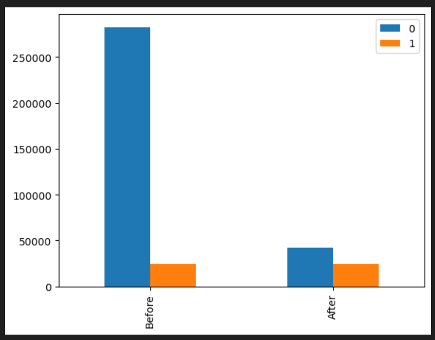
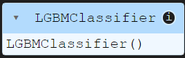
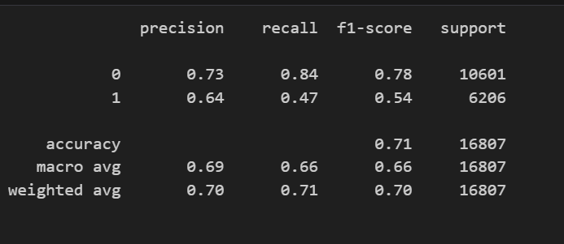
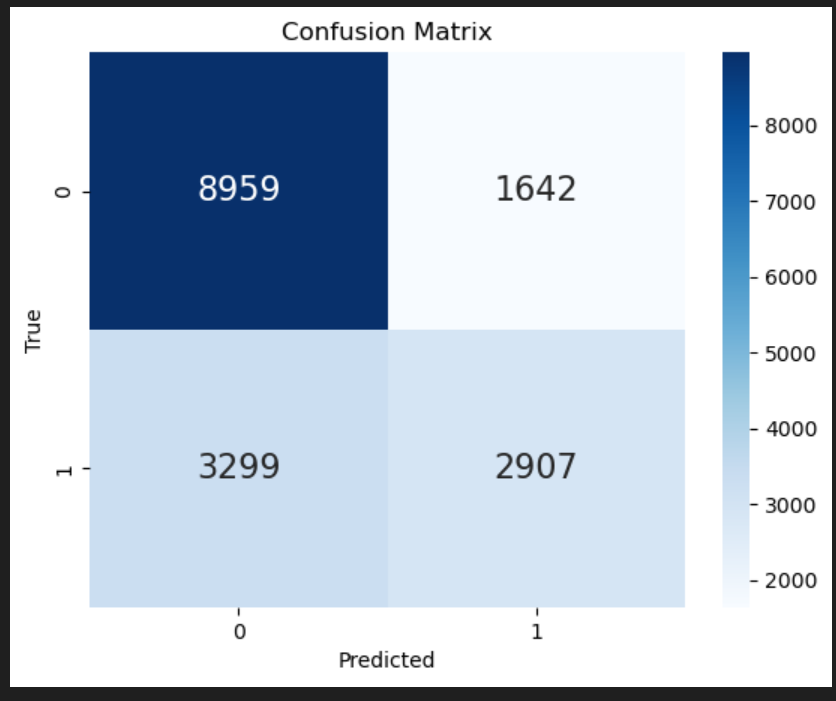
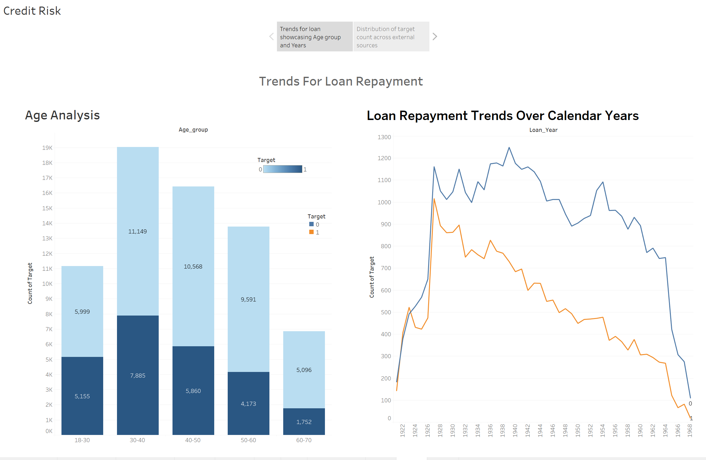
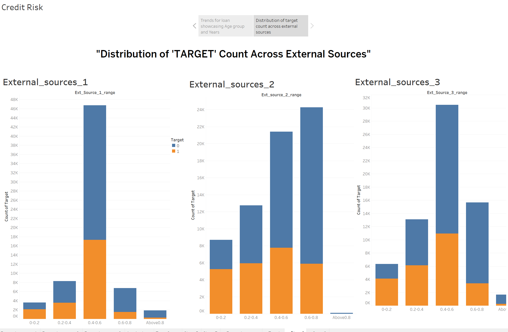

# 

## Overview
This project aims to predict the likelihood of clients facing difficulty in repaying loans. The dataset includes features such as external sources, loan amounts, and client demographics.

## Data Source

https://www.kaggle.com/competitions/home-credit-default-risk/data

- The dataset is loaded from the "application_train.csv" file.
- Selected columns: ['EXT_SOURCE_3', 'EXT_SOURCE_2', 'EXT_SOURCE_1', 'AMT_ANNUITY', 'DAYS_ID_PUBLISH', 'DAYS_BIRTH', 'DAYS_LAST_PHONE_CHANGE', 'DAYS_REGISTRATION', 'DAYS_EMPLOYED', 'AMT_CREDIT', 'AMT_GOODS_PRICE', 'TARGET'].

## Dependencies
- pandas
- lightgbm
- scikit-learn

## Data Preprocessing
- Handling missing values: Imputed missing values in 'EXT_SOURCE_3', 'EXT_SOURCE_2', 'EXT_SOURCE_1', 'AMT_ANNUITY', 'AMT_GOODS_PRICE' using median values.
- Balancing the target classes by undersampling the majority class.

## Exploratory Data Analysis
- Visualized the distribution of target classes before and after undersampling.

## Model Training
- Used LightGBM classifier with specified hyperparameters for training.

## Evaluation
- Utilized metrics such as precision, recall, and classification report to evaluate the model on the test set.

- Visualized the confusion matrix using a heatmap.

## Tableau Visualizations

- Tableau was used to create visualizations for a more comprehensive understanding of the dataset.

### Visualizations
1. **Age Group Analysis:**
   - Bar chart displaying the distribution of clients facing difficulty in loan repayment across different age groups.

2. **Time Series Analysis:**
   - Line chart depicting trends in loan repayment difficulties over the years.

3. **External Sources Analysis:**
   - Bar charts illustrating the impact of external sources (1, 2, 3) on the likelihood of loan repayment difficulties.
   

### How to Access
- To explore detailed visualizations, you can view the Tableau workbook provided in the [Tableau_Visualizations](Tableau_Visualizations) folder.

### Insights
- These visualizations provide additional insights into the factors influencing loan repayment, enhancing the understanding gained from the model evaluation.

## File Structure
- Organized project files with a focus on key features and the target variable.

